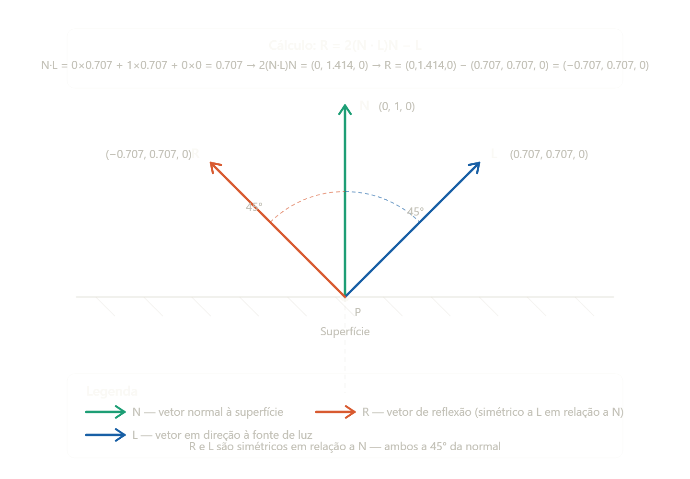
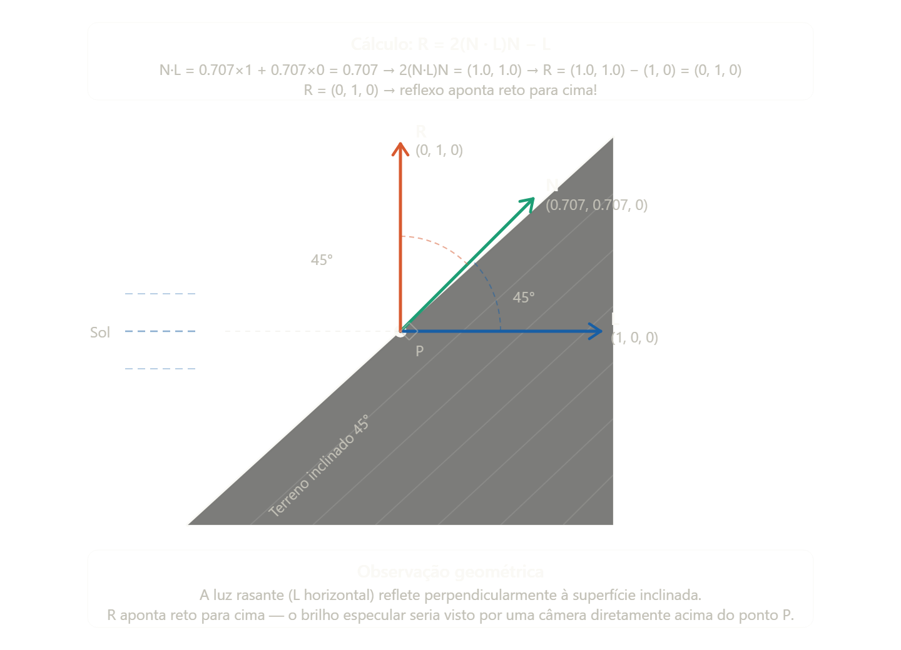
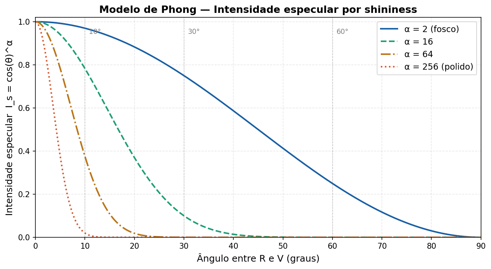
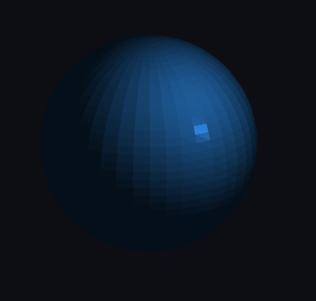

# Atividades aula 6
## Atividade 1
O ponto P é onde a luz atinge a superfície. Os três vetores saem dali:
N = (0, 1, 0) aponta reto para cima (normal perpendicular à superfície). 
L = (0.707, 0.707, 0) aponta 45° para a direita e para cima, em direção à fonte de luz. 
R = (−0.707, 0.707, 0) é o reflexo calculado — sai 45° para a esquerda e para cima, perfeitamente simétrico a L em relação à normal N. 
A simetria é a intuição central aqui: o ângulo de incidência (entre N e L) é igual ao ângulo de reflexão (entre N e R), assim como acontece com um espelho. É exatamente esse vetor R que o modelo de Phong compara com o vetor da câmera (V) para calcular o brilho especular.

## Atividade 2
Com N = (0.707, 0.707, 0) e L = (1, 0, 0), o vetor refletido dá exatamente R = (0, 1, 0) — reto para cima. Isso acontece por uma simetria geométrica bonita: a luz rasante do pôr do sol bate na face inclinada de 45° e reflete verticalmente. 
Na prática do modelo de Phong, isso significa que o brilho especular máximo seria visto por uma câmera posicionada diretamente acima do ponto P. Qualquer câmera em outra posição veria um brilho menor (ou nenhum), dependendo de quanto o vetor V dela se afasta de R.

## Atividade 3

Quanto maior o α (shininess), mais abrupta é a queda da curva. Com α = 2 o brilho é largo e suave — característico de borracha ou gesso. Com α = 256 o brilho quase desaparece após 10°, criando aquele ponto luminoso pequeno e intenso de metais polidos ou plástico brilhante.

## Atividade 4

Com α = 4 o brilho cobre boa parte da esfera de forma suave e difusa. Conforme você sobe com ↑ até α = 128, o ponto de luz vai encolhendo e ficando cada vez mais intenso e concentrado — passando de "plástico fosco" para "metal polido".

## Atividade 5

O brilho especular deixa de ser uma propriedade da luz e passa a ser uma propriedade do material. Isso gera materiais fisicamente impossíveis — uma superfície que muda de cor dependendo do ângulo de visão, como iridescência ou hologramas.

## Atividade 6
**Luz próxima**
 
**Luz distante** 

## Atividade 7

Com a luz direcional, o brilho especular desaparece e reaparece de forma periódica enquanto a esfera gira, porque a face que satisfaz R·V > 0 vai entrando e saindo do campo de visão. Com a luz pontual o brilho é mais estável e se move suavemente.